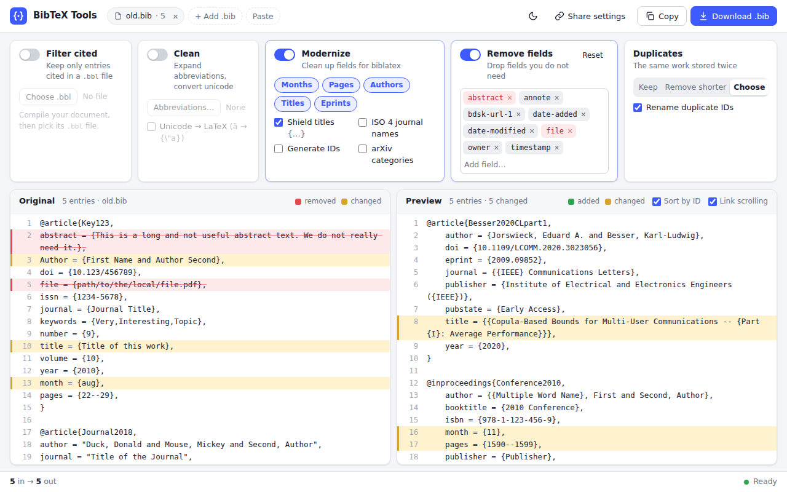

# BibTeX Tools

[](https://pypi.org/project/bibtextools/)
[](https://github.com/klb2/bibtex-tools/actions/workflows/pytest.yml)


This repository contains a collection of functions that might be helpful when
working with BibTeX files (`*.bib`).

The main purpose is to clean up bib files such that match the format for the
[biblatex](https://ctan.org/pkg/biblatex) package.

## Web App
All commands are also available as a web app, which shows the original file
next to the result with the current settings, before you download it:
[ostpopcorn.github.io/bibtex-tool](https://ostpopcorn.github.io/bibtex-tool/)



* Switch the steps of all commands on and off at the top: `filter-cited` (with
  your `.bbl` file), `clean`, `modernize`, removing fields, and duplicate
  entries.  Open, drop, or paste (Ctrl+V) bib files, `.bbl` files, and
  abbreviations.  Multiple bib files are combined like with `combine`.
* Changed fields are highlighted on both sides, and removed fields and entries
  are marked in the original.  Click an entry to show it at the same height on
  the other side.
* Choose which entry of each pair of duplicate entries to remove.
* _Share settings_ copies a link with your settings (not your files) for your
  colleagues.

The web app runs `bibtextools` in your browser with
[Pyodide](https://pyodide.org), so your files never leave your computer.  Only
the eprint IDs are sent to arXiv, if you turn on the arXiv categories.

To run the web app locally, build it and serve it on http://localhost:8000 with
```bash
python3 web/build.py --serve
```
or with `uv run web/build.py --serve` if you use [uv](https://docs.astral.sh/uv/).
The workflow `.github/workflows/web.yml` publishes the web app with GitHub
Pages for every push to `master`.  In the settings of the repository, select
_GitHub Actions_ as the source under _Pages_ once.

## Usage
Right now, the following functions are available

* [**Modernizing bib files:**](#modernizing-bib-files) `modernize`
* [**Cleaning bib files:**](#cleaning-bib-files) `clean`
* [**Combining bib files:**](#combining-bib-files) `combine`
* [**Filtering cited entries:**](#filtering-cited-entries) `filter-cited`


Use `bibtex-tools --help` to list the possible commands and `bibtex-tools
<command> --help` to list the possible options for the sub-command `<command>`.

### Duplicate Entries
The commands `modernize`, `clean`, and `combine` can remove duplicate entries,
i.e., the same work stored more than once, which are detected by similar
titles, authors, and other fields.  No entries are removed by default.  With
`--remove-duplicates`, the entry with less fields of each pair is removed and a
warning lists the removed entries.  With `--interactive` (`-i`), you choose
which entry of each pair to remove.


### Modernizing Bib Files
The command `bibtex-tools modernize` allows to update the format of several
fields in a bib-file.  This includes replacing the deprecated month strings
with the proper number entry, e.g., `month=jan` --> `month={1}`.  There also is
an option to download information from arXiv, if the `eprint` field is
available.

#### Example
If you want to add all relevant information from arXiv (with existing `eprint`
field) in your bib file `literature.bib`, you could use the following command
```bash
bibtex-tools modernize --arxiv literature.bib
```


### Cleaning Bib Files
The command `bibtex-tools clean` allows to clean a bib-files. This includes
replacing unicode characters by the LaTeX version.  It is also possible to pass
an additional file containing abbreviations, e.g., the `IEEEabbr.bib` file that
is often used by authors publishing in IEEE journals.

#### Example
If you want to remove the fields `abstract` and `isbn` from your bib file
`literature.bib`, you could use the following command
```bash
bibtex-tools clean -r abstract isbn literature.bib
```


### Combining Bib Files
The command `bibtex-tools combine` allows combining multiple bib-files into a
single one.  By default, it automatically renames duplicate entry IDs that
might occur after merging the files.

#### Example
If you want to combine the files `1.bib`, `2.bib`, and `3.bib` into a single
file called `literature.bib`, you can use the following command
```bash
bibtex-tools combine -o literature.bib 1.bib 2.bib 3.bib
```


### Filtering Cited Entries
The command `bibtex-tools filter-cited` keeps only the entries of a bib-file
that are cited in a document, e.g., to submit a minimal bib-file with a paper.
The cited keys are read from the `.bbl` file that biber (biblatex) or BibTeX
creates when compiling the document.  Entries that a cited entry refers to,
e.g., via `crossref`, `xdata`, or `related`, are kept as well.

#### Example
If you want to keep only the entries of `literature.bib` that are cited in the
document `paper.tex`, compile the document and use the following command
```bash
bibtex-tools filter-cited --bbl paper.bbl -o paper.bib literature.bib
```


## Installation
You can install the package from PyPI using
```bash
pip3 install bibtextools
```

You can also install the (possibly unstable) development version from the Git
repository using
```bash
git clone https://github.com/klb2/bibtex-tools
cd bibtex-tools
git checkout dev # if you want to checkout the development version
pip3 install . # you can use the -e option to track changes
```
